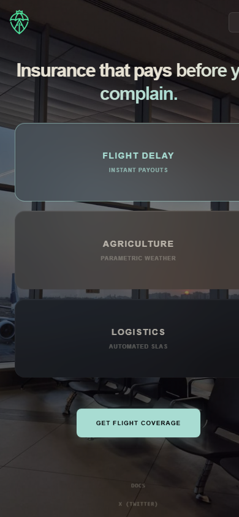
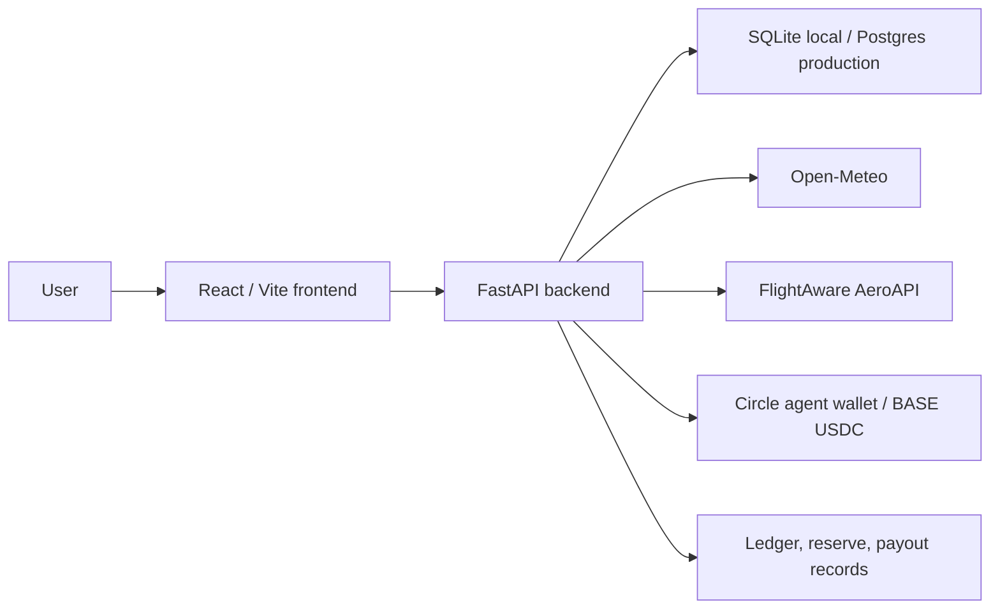

# Arca Protocol

Insurance that pays before you complain.

<p align="left">
  
  
  
  
  
  
  
  
</p>

Arca is a parametric insurance prototype for flight delay, weather, and logistics risk. It replaces manual claims with policy conditions that can be monitored from real-world data feeds, then credits payouts automatically when thresholds are met.


## Positioning

Traditional insurance asks users to file a claim, wait for review, and argue over evidence. Arca models a different experience: users buy coverage against objective events, the system watches the condition, and payout accounting happens without a claims workflow.

The current repository is a full-stack product prototype. It includes a polished Vite/React frontend, a FastAPI backend, SQLite local persistence, Postgres deployment scaffolding, Privy authentication foundations, provider readiness checks, and Circle payout-rail plumbing for controlled internal testing.

## Product Screens

| Desktop | Mobile |
| --- | --- |
|  |  |

## Product State

Provider-backed:

- Privy frontend auth wiring and backend token-verification foundation.
- Open-Meteo-backed weather quotes and monitoring metadata.
- FlightAware provider abstraction when `ARCA_FLIGHTAWARE_API_KEY` is configured.
- Circle agent-wallet status, transfer attempt records, reconciliation, and retry controls.

Simulated or demo-scoped:

- Logistics monitoring uses Arca's built-in SLA simulation rail.
- Policy deployment is a product/backend record, not a deployed Rialo contract.
- Admin-triggered policy resolution remains available for demo flows.
- Live Circle transfers must remain controlled and disabled by default in production environments.

## Features

- Multi-line quote flow for flight delay, agriculture/weather, and logistics coverage.
- Dashboard for active policies, balance, ledger activity, and payout history.
- Policy detail receipts with monitoring metadata and payout status.
- FastAPI product slice for quotes, policies, payouts, withdrawals, balances, ledgers, provider status, reserve status, partner policies, and admin retry controls.
- Privy session bridge from frontend users to Arca backend accounts.
- Environment-driven CORS, auth-required mode, partner API keys, rate limiting, structured request logs, and production startup validation.
- SQLite local default with managed Postgres runtime adapter and Alembic scaffold.
- Circle payout audit records, idempotency, reconciliation, manual retry, due retry, and optional background worker.

## Tech Stack

- React 18, Vite, Tailwind CSS
- Privy React Auth
- FastAPI, Pydantic, SQLite, psycopg/Postgres
- Circle CLI integration for internal BASE USDC payout testing
- GitHub Actions CI, CodeQL, Dependabot
- Vercel-ready frontend config and Render-ready backend manifest

## Architecture



## Quick Start

Install dependencies:

```bash
npm install
python3 -m venv backend/.venv
backend/.venv/bin/python -m pip install -r backend/requirements.txt
```

Create local environment:

```bash
cp .env.example .env
```

Start the backend:

```bash
backend/.venv/bin/python -m uvicorn backend.app.main:app --reload --port 8000
```

Start the frontend:

```bash
npm run dev
```

Open the Vite URL, sign in with Privy, and run the quote/dashboard flow.

## Environment Variables

Use `.env.example` for local development and `deploy/production.env.example` for production shape.

Core local variables:

- `VITE_ARCA_API_URL` - frontend API base URL.
- `VITE_PRIVY_APP_ID` - Privy app id used by the React app.
- `ARCA_DATABASE_URL` - SQLite path locally or Postgres URL in production.
- `ARCA_CORS_ORIGINS` - comma-separated frontend origins allowed by the API.
- `ARCA_AUTH_REQUIRED` - enables backend auth checks.
- `ARCA_AUTH_PROVIDER` - `header`, `privy`, or local/staging-only `test`.
- `ARCA_PRIVY_APP_ID` / `ARCA_PRIVY_JWKS_URL` - Privy backend JWT verification.
- `ARCA_ADMIN_API_TOKEN` - token for `/admin/*` and enabled `/dev/*` routes.
- `ARCA_RATE_LIMIT_BACKEND` - `memory`, `redis`, or `gateway`.
- `ARCA_CIRCLE_TRANSFERS_ENABLED` - keep `false` unless running an approved live transfer test.

Production startup validation rejects unsafe combinations such as SQLite databases, placeholder CORS origins, `ARCA_AUTH_PROVIDER=test`, weak admin tokens, missing Privy verification settings, and live Circle transfers without a configured BASE wallet address.

## Scripts

```bash
npm run dev           # Vite dev server
npm run build         # production frontend build
npm run lint          # ESLint
npm run test:backend  # pytest backend suite
npm run migrate       # backend migrations
npm run smoke         # local API smoke flow
npm run smoke:auth    # auth-required smoke flow with test token
npm run ops:health    # readiness/provider/admin health probe
```

## Verification Status

Last local verification before launch polish:

- `npm run lint` passed.
- `npm run test:backend` passed.
- `backend/.venv/bin/python -m compileall backend/app scripts` passed.
- `npm run build` passed.
- Controlled Circle transfer attempt reached the payout rail but failed before broadcast with `Error: fetch failed`; recent Circle transaction history showed no new accidental transaction.

## Deployment

See [docs/DEPLOYMENT.md](docs/DEPLOYMENT.md) and [docs/deployment-runbook.md](docs/deployment-runbook.md).

High-level flow:

1. Deploy backend with managed Postgres, production env vars, and `/ready` health checks.
2. Deploy frontend to Vercel with `VITE_ARCA_API_URL` and `VITE_PRIVY_APP_ID`.
3. Add the final frontend URL to backend `ARCA_CORS_ORIGINS`.
4. Run migrations and smoke checks.
5. Keep `ARCA_CIRCLE_TRANSFERS_ENABLED=false` until a controlled live payout test is approved.

## Repository Layout

```text
backend/                 FastAPI app, database adapter, migrations, tests
deploy/                  production and staging env templates
docs/                    product, deployment, operations, and recovery docs
docs/assets/             README product screens
public/                  static public assets
scripts/                 smoke, ops, and database utility scripts
src/                     React frontend
.github/                 CI, CodeQL, Dependabot, issue and PR templates
```

## Contributing

See [CONTRIBUTING.md](CONTRIBUTING.md).

## Security

See [SECURITY.md](SECURITY.md). Do not open public issues for vulnerabilities, secrets, or payout-rail abuse paths.

## License

MIT. See [LICENSE](LICENSE).
